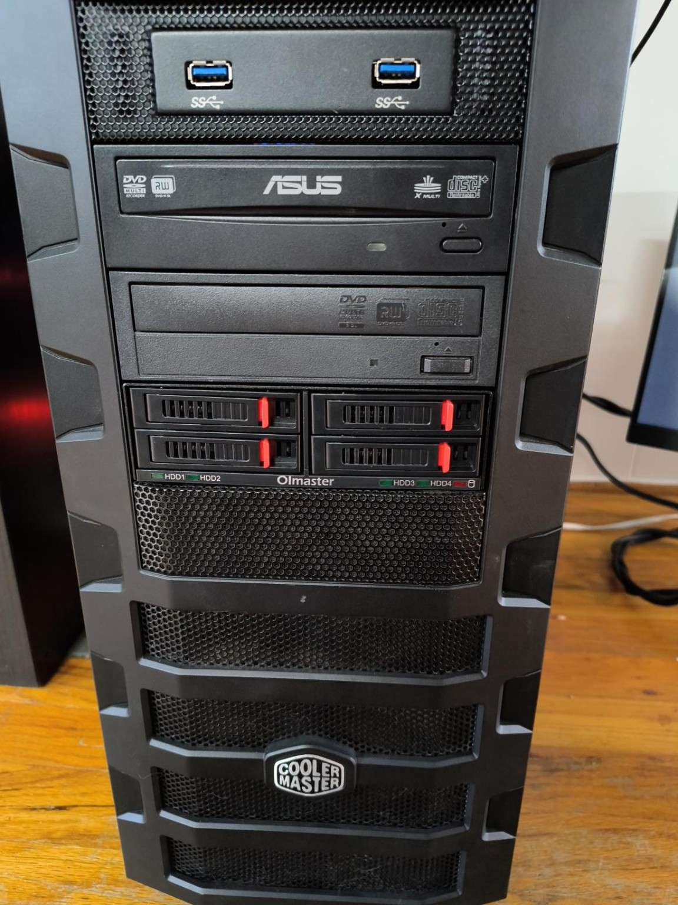
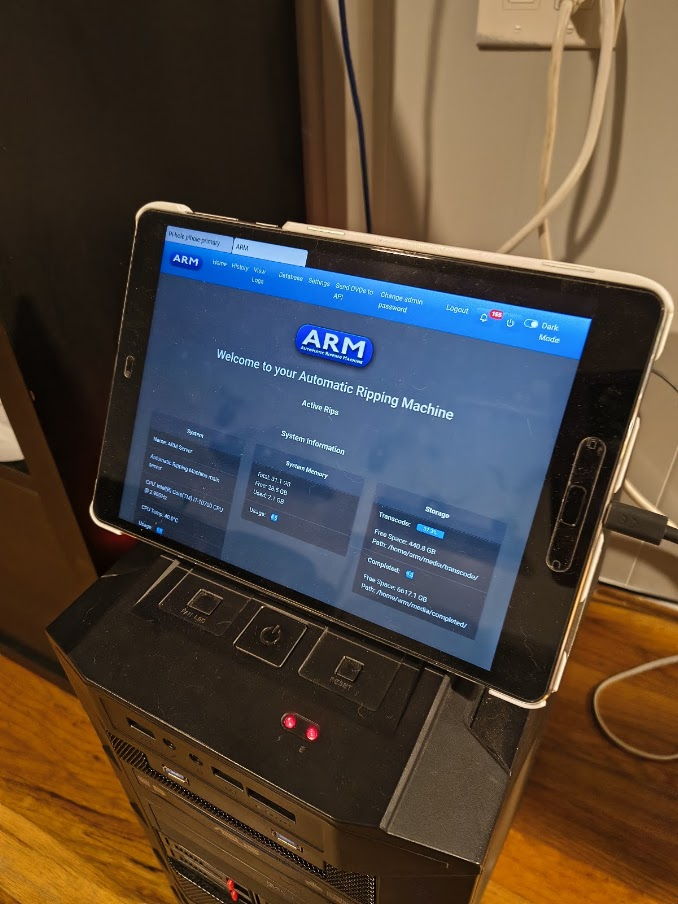
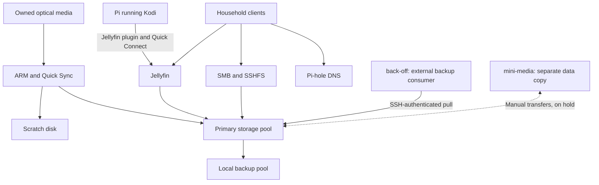

# Media-machine homelab server

Media-machine is a headless Ubuntu server built from reused hardware. It ingests owned optical media, serves a household Jellyfin library, filters DNS through Pi-hole, and stores family files. Independent local disks receive daily replication. It supplies data to the separate back-off backup project and has a separate mini-media copy maintained through manual transfers, currently on hold. All service access is confined to the LAN.

**As-built documentation:** October 3, 2026. This account brings together several months of building, testing, and learning, rather than documenting each step as it happened. Some architectural choices grew out of those experiments and the hardware available. It describes the working system and its deployment source; it is a reference for adapting a similar build, not a universal installation guide. Public templates preserve the deployed layout while separating private credentials and hardware identities. See the [source inventory](docs/artifact-inventory.md) for the records and collection dates.

*The production HAF-922 build, with its optical drives and front-access drive bays.*

*The USB-connected tablet provides a local ARM display and controls through ADB reverse forwarding.*

## What the build demonstrates

- A standard ATX platform running several household services without a desktop environment.
- Intel Quick Sync optical-media processing in a customized Automatic Ripping Machine container.
- Separate system, scratch, primary-data, and local-backup storage roles.
- Mount-aware service startup, daily replication, and weekly configuration capture.
- Windows, Linux, Android, appliance, and USB-tablet access through different service interfaces.
- A backup pull relationship in which the source host does not possess credentials to write the encrypted backup repository.
- Service and storage monitoring through Uptime Kuma, Beszel, and Scrutiny.

## Hardware

| Component | Recorded build |
|---|---|
| Motherboard | ASUS PRIME Z490-A, recorded BIOS 3401 |
| Processor | Intel Core i7-10700, 8 cores / 16 threads |
| Memory | 32GB, four 8GB DIMMs; DDR4-2133, XMP disabled |
| Case and power | Cooler Master HAF-922; Corsair TX650 |
| System disk | KIOXIA 256GB NVMe |
| Scratch disk | WDC WD8088AADS, approximately 808GB |
| Data disks | Four 4TB Seagate enterprise HDDs, two per mergerfs pool |
| Storage controller | LSI SAS2008 HBA, firmware 20.00.07.00, mpt3sas driver |
| Optical drives | Optiarc AD-7280S and ASUS DRW-24B1ST |
| Production network | Onboard 2.5GbE |
| Operating system | Ubuntu Server 24.04.4 LTS; recorded kernel 6.8.0-139-generic |

Versions identify the recorded build, not current upstream recommendations. See [hardware and migration](docs/hardware-and-migration.md).

## Architecture

The back-off arrow shows who initiates the source connection. Its backup implementation belongs to a separate project. Mini-media transfers are manual and currently on hold; no automated bidirectional synchronization is active. Application metadata and user accounts remain separate. The Pi runs Kodi with the Jellyfin plugin and uses Quick Connect authorized through one of the existing Jellyfin accounts.

| Function | Runtime and interface | Startup or schedule |
|---|---|---|
| Optical ingestion | ARM custom Docker image; web TCP 8080 | Guarded systemd startup |
| Playback | Jellyfin Docker; TCP 8096, discovery UDP 7359 | Guarded systemd startup |
| DNS | Pi-hole Docker on a macvlan LAN address; DNS TCP/UDP 53 | Docker restart policy |
| File access | Samba on TCP 445; SSHFS over SSH | Host services |
| Tablet display | USB ADB reverse tunnels; localhost TCP 8080 and 8081 | Reconnecting systemd helper |
| Local data replication | rsync, changed-file versions, no source-deletion propagation | Daily 01:00 America/Los_Angeles |
| Configuration capture | Timestamped application and host snapshots | Sunday 00:15 America/Los_Angeles |
| Monitoring | Beszel agent/socket proxy, Scrutiny, secondary Kuma | Seven Compose definitions included |

Detailed placement and privileges: [services](docs/services.md). Client identities, credentials, and authorization: [access and authentication](docs/access-and-authentication.md).

## Storage

| Path | Purpose |
|---|---|
| `/` | NVMe system disk, OS and container engine |
| `/srv` | Separate scratch/service disk |
| `/mnt/storage-p1`, `/mnt/storage-p2` | Independent primary ext4 members |
| `/srv/storage` | Primary mergerfs pool, approximately 7.2TiB usable display capacity |
| `/srv/media` | Bind mount of `/srv/storage/media` |
| `/mnt/backup-p1`, `/mnt/backup-p2` | Independent local-backup ext4 members |
| `/srv/backup-local` | Local-backup mergerfs pool |
| `/srv/arm/raw`, `/srv/arm/transcode` | Disposable processing data |

Mergerfs provides a combined directory view. It does not make the two member disks a redundant mirror. Local replication is a separate protection layer. See [storage and backup](docs/storage-and-backup.md).

## Deployment source

The repository includes [service scripts](scripts/README.md), [systemd units](systemd/), [Compose definitions](compose/), [host configuration templates](config/), and the [QSV base image recipe](image/arm-qsv-base/) and [ARM Rev2 build context and patch](image/arm-rev2/). Use the [build and deployment notes](docs/build-guide.md) to adapt paths, accounts, devices, networking, and private credentials. These files document this build; the public package contains no application databases or recovery credentials.

## Client relationships

| Client | Relationship |
|---|---|
| Four Jellyfin users | Individual media playback accounts |
| One Windows user | Authenticated read/write access to the Storage share |
| mini-media | HP Z240 motherboard in a Z230 chassis; manual data transfers currently on hold; metadata and users remain separate |
| Pi 3 B+ playback client | Kodi with the Jellyfin plugin; Quick Connect uses an existing Jellyfin account |
| USB tablet | ARM/Pi-hole monitoring and controls through ADB reverse forwarding |
| back-off | Z230 project; media-machine is its data source |

## Recorded validation

The ASUS migration preserved the Ubuntu NVMe installation, storage pools, both optical drives, and ARM/Jellyfin/Pi-hole service operation. Pi-hole's macvlan parent and host shim were updated for the new NIC. The USB tablet survived restart and reconnection tests. A completed local replication was followed by a dry run with zero changes. Configuration snapshots and the portable custom ARM image archive passed checksum verification.

[Validation](docs/validation-and-open-work.md) separates recorded tests from source-reconstruction work.

## Reading order

1. [Hardware and migration](docs/hardware-and-migration.md)
2. [Service placement and startup](docs/services.md)
3. [Storage and backup](docs/storage-and-backup.md)
4. [Access and authentication](docs/access-and-authentication.md)
5. [Ingestion workflow](docs/ingestion.md)
6. [Recovery procedure](docs/recovery.md)
7. [Build and deployment notes](docs/build-guide.md)
8. [Validation and source coverage](docs/validation-and-open-work.md)

## Public examples and private state

Network examples use documentation-only addresses and role aliases. Passwords, private keys, API keys, session data, monitoring tokens, device serials, MAC addresses, filesystem UUIDs, and personal file inventories are excluded. The real recovery archive remains separate from this public repository.

## Author and license

Jack Walter designed, assembled, configured, and tested the system. This documentation was organized with ChatGPT assistance from his project records. Original repository material is licensed under [Apache 2.0](LICENSE). Upstream applications and any adapted source retain their applicable licenses and notices. See [provenance](docs/provenance.md).
