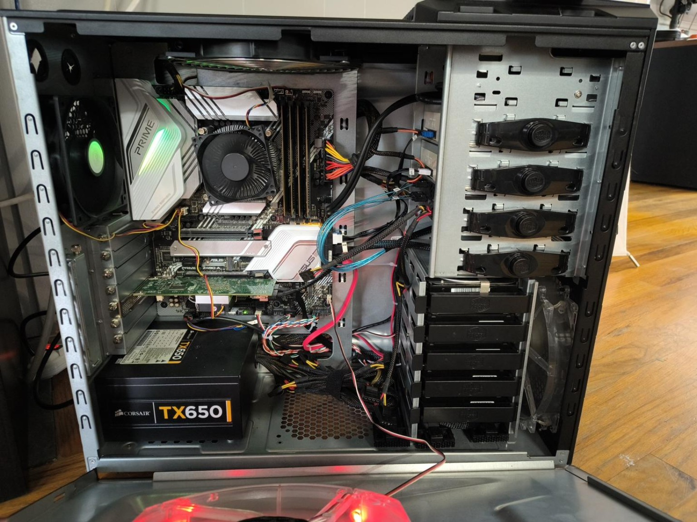
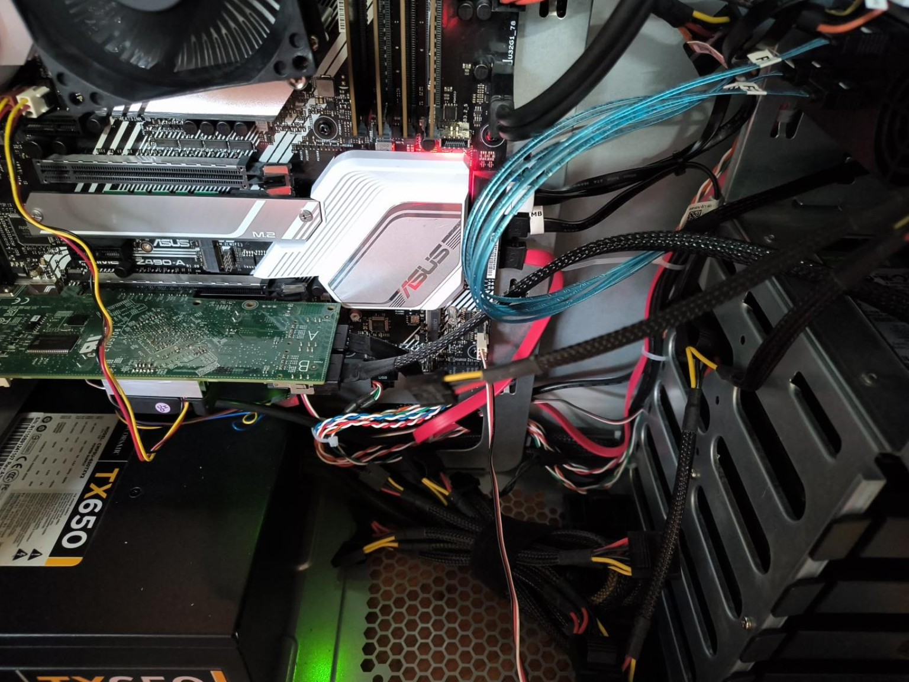
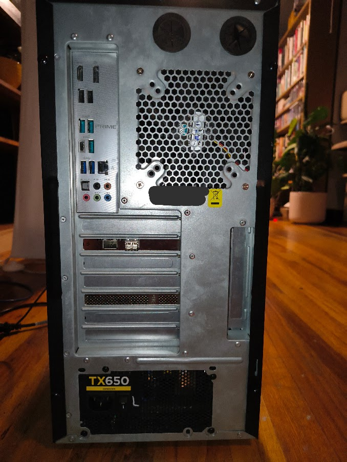

# Hardware and migration

## Current platform

The production build uses an ASUS PRIME Z490-A motherboard in a Cooler Master HAF-922 case. The i7-10700, NVMe installation, LSI HBA, storage disks, and optical-media workload were carried forward from a Dell OptiPlex 7090 experiment. Ubuntu booted from the migrated NVMe without a reinstall or boot repair.

The four memory modules are arranged as matched pairs across channels: one pair in A1/B1 and the other in A2/B2. The recorded stable setup runs at DDR4-2133 with XMP disabled.

*The ASUS motherboard, Intel cooler, storage controller and drive layout in the reused HAF-922 chassis.*

*The LSI HBA and drive cabling, with dedicated cooling for the controller.*

*Rear connections of the production build. The chassis identification label is obscured; the chassis predates the current internals.*

## Cooling

| Device | Header | Recorded control |
|---|---|---|
| Intel stock CPU cooler | CPU_FAN | PWM |
| Rear exhaust | CHA_FAN1 | DC / Q-Fan |
| Front intake | CHA_FAN2 | DC / Q-Fan |
| Top exhaust | CPU_OPT | CPU-oriented control |
| Side intake | M.2_FAN | DC / Q-Fan |
| Dedicated HBA fan | AIO_PUMP | Continuous high speed |

Post-build observations were approximately 35 C CPU package, 40 C NVMe, 39-43 C data HDDs, and 30 C scratch HDD. These are individual recorded observations, not a continuous thermal test series. The M.2_FAN assignment does not establish that NVMe temperature controls that header.

## Migration work

The onboard interface changed from the Dell NIC to the ASUS NIC, recorded as `enp5s0`. Netplan, Pi-hole's externally managed macvlan network, and the host macvlan shim were updated. Changing a Compose file alone did not update the already-created external Docker network.

Storage identity and mounts were checked after migration. Use stable UUIDs or filesystem labels in private deployment configuration rather than assuming `/dev/sdX` ordering. Real serials and UUIDs are deliberately absent from this repository.

Acceptance records show healthy ARM, Jellyfin, and Pi-hole containers, both optical drives present, expected storage mounted, successful DNS responses, and a 2.5GbE production link. The recorded Linux kernel is 6.8.0-139-generic.

## Retired designs

The Dell proprietary motherboard adapters, HAF-932 case, Dell SMM fan control, dual-PSU implementation via Add2PSU, and ESP32 fan controller are historical experiments. They are not components of the production ASUS build.

## Temporary 10GbE qualification

A direct optical link to the Z230 was used for initial seeding and measured ~9.4Gb/s in the recorded network test. Initial file transfer was disk limited. The permanent production path remains the onboard 2.5GbE LAN. A core-network or virtual-router redesign is not part of this build.

